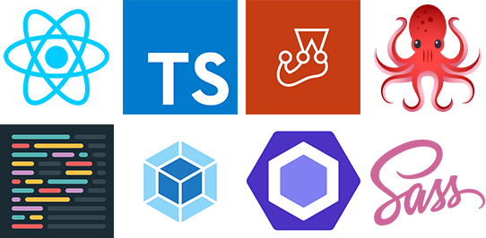

# Minimalistic React starter

  

Featuring :

- React (duh)
- Typescript
- Jest
- React Testing Library
- Sass
- ESlint
- Webpack / babel

## Available commands

- `start` : Launch the webpack server, for development purposes
- `build` : Bundle a production package in the _dist_ folder
- `test` : Launch tests with Jest
- `lint` : Run ESLint on all tsx files
- `prettier` : Prettify all the files
- `prettier:ci` : Check if Prettify has been ran
